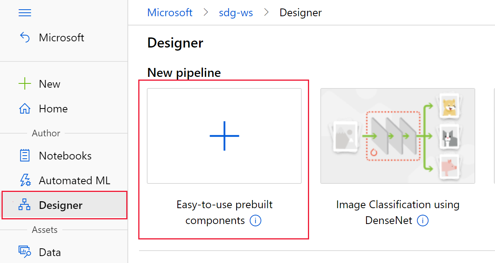
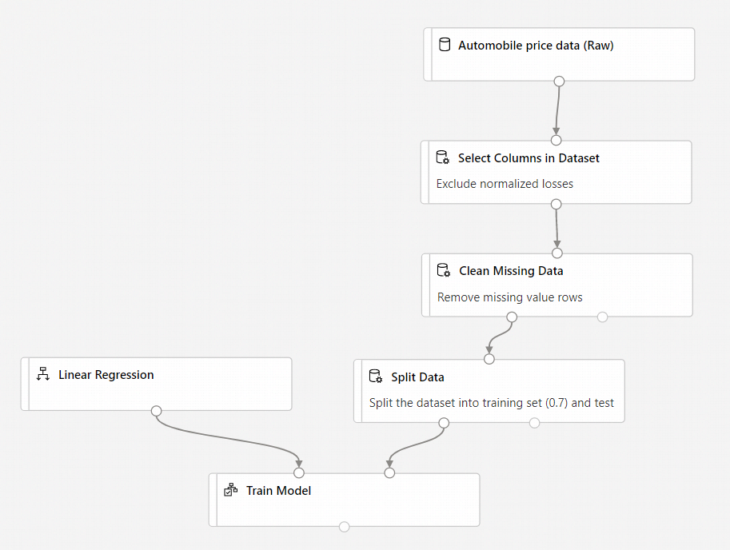
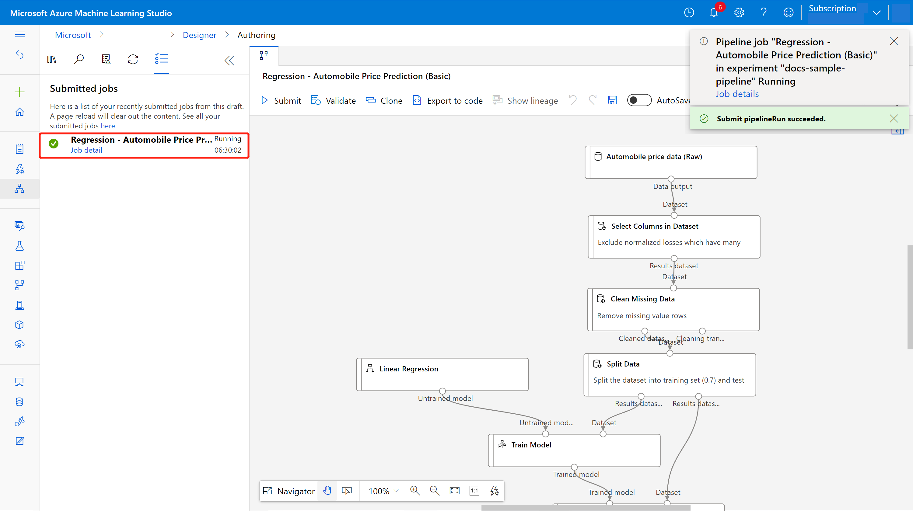
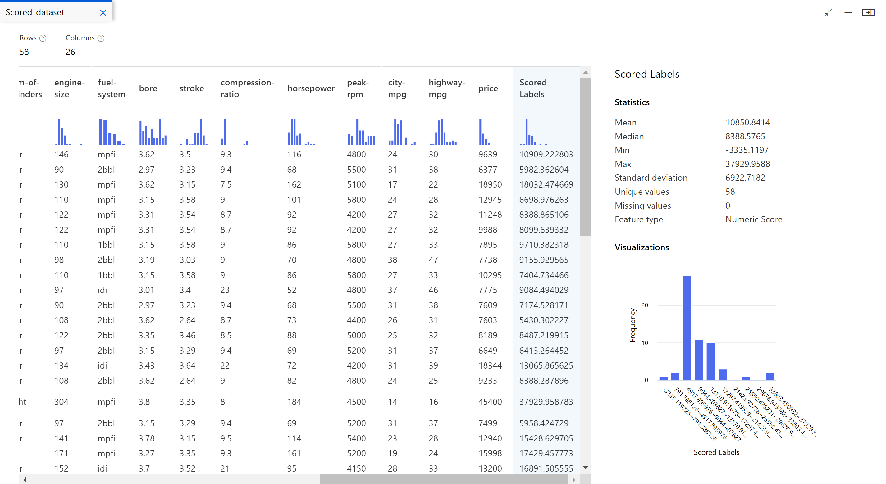

# Challenge 6

Another way of creating models in Azure Machine Learning without coding is the **Azure Machine Learning Designer**. In this challenge, we'll take an automobile price data set and use the Designer to create our own machine learning pipeline to predict car prices.

The Designer offers a range of pre-built functions commonly used in machine learning problems, such as data cleaning, splitting, model training and evaluation. In addition, it allows users to run their own custom code written in Python or R. Similarly to **AutoML**, it enables data scientists, analysts, and developers to build ML models with high scale, efficiency, and productivity. However, it requires more input from the user and a more extensive knowledge of machine learning best practices than AutoML.

**When to use it?**

Use the Designer to use pre-built functions via drag-and-drop for the quick development of custom machine learning pipelines that support, but do not require coding. You can use the Designer to:

- Implement ML solutions without extensive programming knowledge, but with the option to add custom code
- Create data preprocessing pipelines, e.g. to handle missing values
- Save time and resources
- Leverage data science best practices
- Provide agile problem-solving

## Dataset

For this challenge, we'll use the **Automobile price data** dataset. It contains data on cars including brand, fuel type, fuel economy, engine power output, body style and the car's price. The goal of this challenge will be to use the cars' technical properties as features to predict a car's price.

## Azure Machine Learning Designer

### Setup

In your Machine Learning workspace, navigate to the **Designer** section and select **Easy-to-use prebuilt components**.

To run our pipeline, we need to define a compute target.

1. Next to the pipeline name, select the Gear icon  that is in the UI at the top of the canvas to open the 'Settings' pane.

2. In the **Settings** pane to the right of the canvas, select **Select compute type** and then **Compute Instance**.

If you already have an available Azure ML compute instance, you can select it to run this pipeline.

1. Enter a name for the compute resource.

2. Select **Save**.

### Data Preparation

#### Data Loading

There are several sample datasets included in the designer for you to experiment with. For this tutorial, use 'Automobile price data (Raw)'.

1. To the left of the pipeline canvas is a palette of datasets and components. Select **Sample datasets** to view the available sample datasets.

2. Select the dataset **Automobile price data (Raw)**, and drag it onto the canvas.

### Visualize the data

You can visualize the data to understand the dataset that you'll use.

1. Right-click the **Automobile price data (Raw)** and select **Preview Data**.

1. Select the different columns in the data window to view information about each one.

   Each row represents an automobile, and the variables associated with each automobile appear as columns. There are 205 rows and 26 columns in this dataset.

#### Column Selection

When you train a model, you have to do something about the data that's missing. In this dataset, the **normalized-losses** column is missing many values, so you'll exclude that column from the model altogether.

1. In the component palette to the left of the canvas, expand the **Data Transformation** section and find the **Select Columns in Dataset** component.

2. Drag the **Select Columns in Dataset** component onto the canvas. Drop the component below the dataset component.

3. Connect the **Automobile price data (Raw)** dataset to the **Select Columns in Dataset** component. Drag from the dataset's output port, which is the small circle at the bottom of the dataset on the canvas, to the input port of **Select Columns in Dataset**, which is the small circle at the top of the component.

4. Select the **Select Columns in Dataset** component.

1. In the component details pane to the right of the canvas, select **Edit column**.

1. Expand the **Column names** drop down next to **Include**, and select **All columns**.

1. Select the **+** to add a new rule.

1. From the drop-down menus, select **Exclude** and **Column names**.

1. Enter _normalized-losses_ in the text box.

1. In the lower right, select **Save** to close the column selector.

1. Select the **Select Columns in Dataset** component.

1. In the component details pane to the right of the canvas, select the **Comment** text box and enter _Exclude normalized losses_.

   Comments will appear on the graph to help you organize your pipeline.

#### Clean missing data

Your dataset still has missing values after you remove the **normalized-losses** column. You can remove the remaining missing data by using the **Clean Missing Data** component.

1. In the component palette to the left of the canvas, expand the section **Data Transformation**, and find the **Clean Missing Data** component.

1. Drag the **Clean Missing Data** component to the pipeline canvas. Connect it to the **Select Columns in Dataset** component.

1. Select the **Clean Missing Data** component.

1. In the component details pane to the right of the canvas, select **Edit Column**.

1. In the **Columns to be cleaned** window that appears, expand the drop-down menu next to **Include**. Select, **All columns**

1. Select **Save**

1. In the component details pane to the right of the canvas, select **Remove entire row** under **Cleaning mode**.

1. In the component details pane to the right of the canvas, select the **Comment** box, and enter _Remove missing value rows_.

Your pipeline should now look something like this:

### Train a machine learning model

Now that you have the components in place to process the data, you can set up the training components.

Because you want to predict price, which is a number, you can use a regression algorithm. For this example, you use a linear regression model.

#### Split the data

Splitting data is a common task in machine learning. You'll split your data into two separate datasets. One dataset will train the model and the other will test how well the model performed.

1. In the component palette, expand the section **Data Transformation** and find the **Split Data** component.

1. Drag the **Split Data** component to the pipeline canvas.

1. Connect the left port of the **Clean Missing Data** component to the **Split Data** component. Be sure that the left output ports of **Clean Missing Data** connects to **Split Data**. The left port contains the cleaned data. The right port contains the discarded data.

1. Select the **Split Data** component.

1. In the component details pane to the right of the canvas, set the **Fraction of rows in the first output dataset** to 0.7.

   This option splits 70 percent of the data to train the model and 30 percent for testing it. The 70 percent dataset will be accessible through the left output port. The remaining data will be available through the right output port.

1. In the component details pane to the right of the canvas, select the **Comment** box, and enter _Split the dataset into training set (0.7) and test set (0.3)_.

#### Train the model

Train the model by giving it a dataset that includes the price. The algorithm constructs a **regression** model that explains the relationship between the features and the price as presented by the training data. The main goal of regression models is to predict a numeric output variable for new data based on learnings from its training data. Common regression examples include insurance risk assessment, predicting advertisement impact or modelling the effect of seasonal conditions like weather to predict product sales.

1. In the component palette, expand **Machine Learning Algorithms**.

   This option displays several categories of components that you can use to initialize learning algorithms.

1. Select **Regression** > **Linear Regression**, and drag it to the pipeline canvas.

1. In the component palette, expand the section **Module training**, and drag the **Train Model** component to the canvas.

1. Connect the output of the **Linear Regression** component to the left input of the **Train Model** component.

1. Connect the training data output (left port) of the **Split Data** component to the right input of the **Train Model** component. Be sure that the left output ports of Split Data connects to Train Model. The left port contains the training set. The right port contains the test set.

1. Select the **Train Model** component.

1. In the component details pane to the right of the canvas, select **Edit column** selector.

1. In the **Label column** dialog box, expand the drop-down menu and select **Column names**.

1. In the text box, enter _price_ to specify the value that your model is going to predict. Make sure you enter the column name exactly. Do not capitalize price.

Your pipeline should look like this:

#### Add the Score Model component

After you train your model by using 70 percent of the data, you can use it to score the other 30 percent to see how well your model functions.

1. Enter _score model_ in the search box to find the **Score Model** component. Drag the component to the pipeline canvas.

1. Connect the output of the **Train Model** component to the left input port of **Score Model**. Connect the test data output (right port) of the **Split Data** component to the right input port of **Score Model**.

#### Add the Evaluate Model component

Use the **Evaluate Model** component to evaluate how well your model scored the test dataset.

1. Enter _evaluate_ in the search box to find the **Evaluate Model** component. Drag the component to the pipeline canvas.

1. Connect the output of the **Score Model** component to the left input of **Evaluate Model**.

   The final pipeline should look something like this:

### Submit the pipeline

Now that your pipeline is all setup, you can submit a pipeline run to train your machine learning model. You can submit a valid pipeline run at any point, which can be used to review changes to your pipeline during development.

1. At the top of the canvas, select **Submit**.

1. In the **Set up pipeline job** dialog box, select **Create new**.

   > Experiments group similar pipeline runs together. If you run a pipeline multiple times, you can select the same experiment for successive runs.

1. For **New experiment Name**, enter **Tutorial-CarPrices**.

1. Select **Submit**.

1. You'll see a submission list in the left pane of the canvas, and a notification will pop up at the top right corner of the page. You can select the **Job detail** link to go to job detail page for debugging.

If this is the first run, it may take up to 20 minutes for your pipeline to finish running. The default compute settings have a minimum node size of 0, which means that the designer must allocate resources after being idle. Repeated pipeline runs will take less time since the compute resources are already allocated. Additionally, the designer uses cached results for each component to further improve efficiency.

#### View scored labels

In the job detail page, you can check the pipeline job status, results and logs.

After the run completes, you can view the results of the pipeline run. First, look at the predictions generated by the regression model.

1. Right-click the **Score Model** component, and select **Preview data** > **Scored dataset** to view its output.

   Here you can see the predicted prices and the actual prices from the testing data.

#### Evaluate models

Use the **Evaluate Model** to see how well the trained model performed on the test dataset.

1. Right-click the **Evaluate Model** component and select **Preview data** > **Evaluation results** to view its output.

The following statistics are shown for your model:

- **Mean Absolute Error (MAE)**: The average of absolute errors. An error is the difference between the predicted value and the actual value.
- **Root Mean Squared Error (RMSE)**: The square root of the average of squared errors of predictions made on the test dataset.
- **Relative Absolute Error**: The average of absolute errors relative to the absolute difference between actual values and the average of all actual values.
- **Relative Squared Error**: The average of squared errors relative to the squared difference between the actual values and the average of all actual values.
- **Coefficient of Determination**: Also known as the R squared value, this statistical metric indicates how well a model fits the data.

For each of the error statistics, smaller is better. A smaller value indicates that the predictions are closer to the actual values. For the coefficient of determination, the closer its value is to one (1.0), the better the predictions.

At this point, we learned how to:

- Create a new pipeline.
- Import data.
- Prepare data.
- Train a machine learning model.
- Evaluate a machine learning model.

So far, we have focused on deploying models to Azure Container Instances, which is great for testing scenarios. For production grade deployments, we want to use Azure Kubernetes Service, which we'll do in the [seventh challenge](challenge_07.md).
